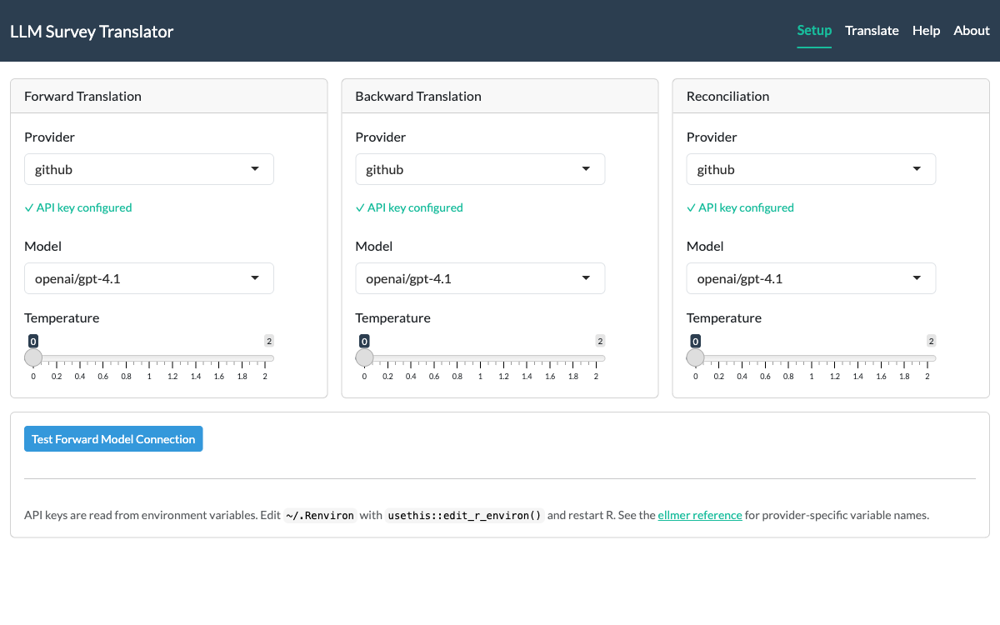
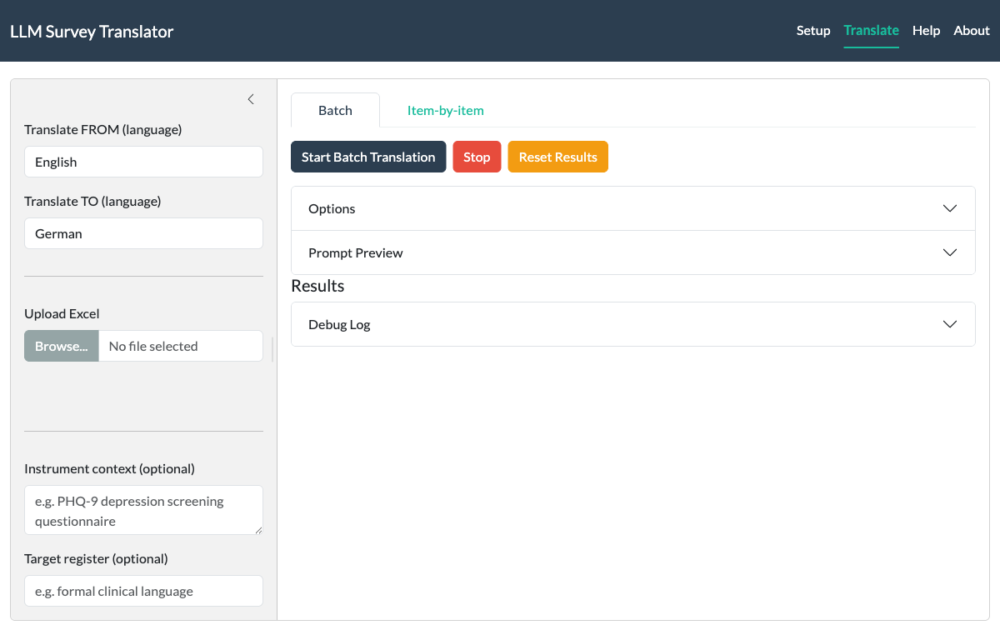
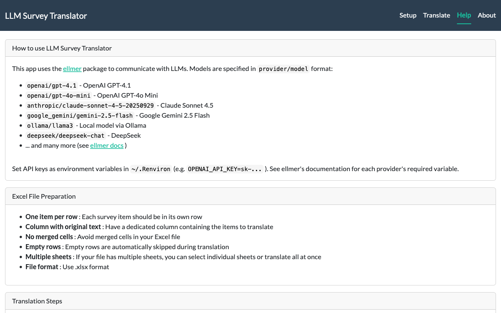

```{r, include = FALSE}
knitr::opts_chunk$set(
  collapse = TRUE,
  comment = "#>",
  eval = FALSE
)
```

You have a validated questionnaire in English.
You need it in Norwegian, German, and Mandarin by next month.
The traditional route --- two independent translators per language, a reconciliation panel, weeks of scheduling --- is thorough, but it grinds.

LLMTranslate automates the heavy lifting of that process.
It follows the same TRAPD/ISPOR framework that translation panels use --- forward translation, blind back-translation, and reconciliation with severity ratings (see [Harkness et al., 2010](https://doi.org/10.1002/9780470609927.ch7); [Wild et al., 2005](https://doi.org/10.1111/j.1524-4733.2005.04054.x)).
The difference is that the "panel" is an LLM, and a full three-stage pipeline finishes in minutes rather than weeks.

## A practical workflow

LLM translation works best as the first step, not the last.

1. **Run the Shiny app** or `translate_batch()` with context and register to get a structured first draft
2. **Review severity ratings** --- focus human attention on items flagged "major"
3. **Expert review** --- a bilingual domain expert reviews the reconciled output, not a blank page
4. **Iterate** --- adjust context, register, or model and re-run items that need it
5. **Document** --- the Shiny app includes model, prompt, and debug logs in the Excel download; from R, use `translation_log()` to save the audit trail alongside your results

The goal is not to skip human judgement.
It is to make that judgement faster and better-informed.

## Setting up your LLM provider

LLMTranslate talks to LLMs through the
[ellmer](https://ellmer.tidyverse.org/) package.
That means any provider ellmer supports --- OpenAI, Anthropic Claude, Google Gemini, Azure, Ollama, DeepSeek, Groq, Mistral, and others --- works here without extra configuration.

The one thing you need: an API key (unless using local Ollama), stored as an environment variable.
Edit your `~/.Renviron` file (create it if it doesn't exist):

```r
# Open .Renviron for editing
usethis::edit_r_environ()
```

Then add the key for your provider:

```sh
# Pick one (or several):
OPENAI_API_KEY=sk-...
ANTHROPIC_API_KEY=sk-ant-...
GOOGLE_API_KEY=AIza...
```

Restart R after saving.
The key is now available to every R session on your machine.

For provider-specific setup (Azure endpoints, AWS Bedrock credentials, Ollama configuration), see the
[ellmer getting started vignette](https://ellmer.tidyverse.org/articles/ellmer.html).

### Model strings

LLMTranslate identifies models with a `provider/model` string:

```r
"openai/gpt-4.1"
"anthropic/claude-sonnet-4-5-20250929"
"google_gemini/gemini-2.5-flash"
"ollama/llama3"
```

The part before the slash maps to an ellmer provider.
The part after is the model name that provider recognizes.

## Key concepts

Before diving into the app or the R functions, a few concepts that apply to both.

### The TRAPD/ISPOR pipeline

The translation runs up to three stages, following established frameworks for cross-cultural survey adaptation ([Harkness et al., 2010](https://doi.org/10.1002/9780470609927.ch7); [Wild et al., 2005](https://doi.org/10.1111/j.1524-4733.2005.04054.x)):

**Forward translation** aims for conceptual equivalence.
The prompt instructs the model to preserve meaning, polarity, quantifiers, and response scale anchors --- not to produce a word-for-word literal rendering.

**Back-translation** is deliberately literal.
A separate prompt translates the forward output back to the source language without seeing the original.
Awkwardness in the back-translation is informative: it reveals where the forward translation may have drifted.

**Reconciliation** compares the original against the back-translation and classifies each item:

- **none** --- conceptually equivalent, no revision needed
- **minor** --- stylistic difference that doesn't affect measurement
- **major** --- meaning shift, polarity change, or omission that could affect respondent interpretation

Only "major" items get revised.
The explanation column documents what differed and why, giving human reviewers a head start.

Back-translation and reconciliation are optional.
You can run forward translation alone, or forward plus back-translation without reconciliation.

### Batch vs. item-by-item

LLMTranslate offers two translation modes, available in both the app and the R functions.
Both produce identical output columns --- the difference is how they talk to the LLM.

**Batch** sends all items in a single prompt per stage.
The LLM sees the entire instrument at once, which helps it maintain consistent terminology across items.
Three API calls total (forward, back, reconciliation).
Use this for instruments under ~100 items, or set `batch_size` to split larger instruments into manageable chunks (see below).

**Item-by-item** sends one item per API call.
Slower, but each item succeeds or fails independently --- a rate limit error on item 47 doesn't lose the first 46.
Progress bars show exactly where you are.
Better for large instruments or rate-limited APIs.

### Controlling batch size

By default, `translate_batch()` sends all items in a single LLM call per stage.
For large instruments this can hit token limits or produce unreliable output.
The `batch_size` parameter splits items into smaller groups while keeping the benefits of batch mode (cross-item consistency within each group, fewer API calls than item-by-item).

A 400-item questionnaire with `batch_size = 100` makes 4 calls per stage instead of 1 --- still far fewer than 400 item-by-item calls, and each batch is small enough to stay within token limits.

In the Shiny app, set **Batch size** under **Options** in the Batch tab.
Leave it blank (the default) to send everything in one call.

### Context and register

Translation quality improves when the model knows what it's translating and who the audience is.

**Context** describes the instrument --- what it measures and where it's used.
Something like "PHQ-9 depression screening questionnaire, used in primary care" gives the model enough to make informed choices about clinical terminology.

**Register** guides tone and reading level.
"Use formal clinical language" produces different output than "Use informal language appropriate for adolescents aged 13--17."

Both are optional, but together they steer the model toward translations that fit the instrument's purpose and audience.

## The Shiny app

The fastest way to get started is the interactive app:

```{r}
LLMTranslate::run_app()
```

### Setup tab

The app opens on the **Setup** tab, where you configure models for each stage of the pipeline --- forward translation, back-translation, and reconciliation.
Pick a provider from the dropdown, choose a model, and adjust temperature if needed.
Green badges confirm your API key is detected.

```{r, echo = FALSE, eval = TRUE, out.width = "100%", fig.alt = "Setup tab showing three cards for Forward Translation, Backward Translation, and Reconciliation, each with provider dropdown, API key status badge, model selector, and temperature slider."}

```

Hit **Test Forward Model Connection** to verify everything works before committing to a full run.

### Translate tab

Switch to the **Translate** tab to do the actual work.
The sidebar on the left handles your inputs: source and target languages, Excel file upload, column selection, and the optional context and register fields.
The main panel offers both **Batch** and **Item-by-item** modes.

```{r, echo = FALSE, eval = TRUE, out.width = "100%", fig.alt = "Translate tab with a sidebar for language and file settings, and a main panel with Batch and Item-by-item tabs, control buttons, and collapsible panels for Options, Prompt Preview, and Debug Log."}

```

Upload an Excel file, pick the column containing your survey items, and hit **Start Batch Translation**.
A progress bar tracks each stage.
The first translated item appears in a live preview so you can spot problems early --- before the full run finishes.

When translation completes, download the results as an Excel workbook.
The download includes not just the translations, but also a **Model Selection Log** (which model and temperature were used at each stage), a **Prompt Log** (the exact text sent to the LLM), and a **Debug Log** (timestamped record of every LLM call, response preview, and processing step) --- a full audit trail for reproducibility.
The debug log is always captured regardless of whether the "Verbose debug" checkbox is ticked; that checkbox only controls whether the log is displayed live in the UI.

### Help tab

The **Help** tab documents model string formats, Excel file preparation guidelines, and step-by-step translation instructions --- all within the app itself.

```{r, echo = FALSE, eval = TRUE, out.width = "100%", fig.alt = "Help tab showing model format examples, Excel file preparation guidelines, and translation steps."}

```

The app reads API keys from the same environment variables described in the setup section above.
No credentials are entered in the UI.

## Translating from R

The app is convenient for exploration and one-off jobs.
For scripted workflows --- translating multiple instruments, comparing models, or integrating into a pipeline --- use the R functions directly.

### Your first translation

```{r}
library(LLMTranslate)

df <- data.frame(
  item = c(
    "I have felt cheerful and in good spirits",
    "I have felt calm and relaxed",
    "I have felt active and vigorous",
    "My daily life has been filled with things that interest me",
    "I woke up feeling fresh and rested"
  )
)

result <- translate_batch(
  data = df,
  column = "item",
  from_lang = "English",
  to_lang = "Norwegian",
  model = "openai/gpt-4.1"
)
```

That single call runs the full three-stage pipeline: forward translation, back-translation, and reconciliation.
The result is your original data frame with new columns appended:

- `Forward_Norwegian` --- the translated items
- `Back_English` --- blind back-translations (quality check)
- `Reconciled_Norwegian` --- revised translations where the reconciliation found issues
- `Recon_Explanation` --- what differed and why
- `Recon_Severity` --- `"none"`, `"minor"`, or `"major"` per item

### Skipping stages

Not every run needs back-translation.
If you want forward translation only:

```{r}
result <- translate_batch(
  df,
  "item",
  "English",
  "Norwegian",
  model = "openai/gpt-4.1",
  back_model = NULL
)
```

Setting `back_model = NULL` skips back-translation (and reconciliation, since reconciliation depends on it).
You can also keep back-translation but skip reconciliation with `recon_model = NULL`.

### Using different models per stage

Forward translation benefits from a capable model that understands nuance.
Back-translation is a simpler task --- a faster, cheaper model works fine:

```{r}
result <- translate_batch(
  df,
  "item",
  "English",
  "Norwegian",
  model = "anthropic/claude-sonnet-4-5-20250929",
  back_model = "openai/gpt-4.1-mini",
  recon_model = "anthropic/claude-sonnet-4-5-20250929"
)
```

### Batch size for large instruments

For a long questionnaire, set `batch_size` to avoid token limits while keeping batch-mode consistency:

```{r}
result <- translate_batch(
  df,
  "item",
  "English",
  "German",
  model = "openai/gpt-4.1",
  batch_size = 50
)
```

This sends items in groups of 50 per stage.
Each group is translated in a single LLM call, so cross-item terminology stays consistent within each batch.

### Item-by-item translation

For large instruments or rate-limited APIs, use `translate_item()` instead:

```{r}
result <- translate_item(
  df,
  "item",
  "English",
  "German",
  model = "openai/gpt-4.1",
  verbose = TRUE
)
```

The interface is identical to `translate_batch()` --- same parameters, same output columns (except `batch_size`, which only applies to `translate_batch()`).
Set `verbose = TRUE` on either function to see timestamped logs of each LLM call and response preview.

### Accessing the audit log

When you run with `verbose = TRUE`, the returned data frame carries a `"log"` attribute with the full debug trace.
Use the convenience accessors to pull it out:

```{r}
result <- translate_batch(
  df,
  "item",
  "English",
  "Norwegian",
  model = "openai/gpt-4.1",
  verbose = TRUE
)

translation_log(result)
#> [1] "14:32:01 | Model: openai/gpt-4.1 | Prompt(first 120): ..."
#> [2] "14:32:03 | Response(first 120): ..."
#> ...
```

`translation_log()` returns the character vector of timestamped messages.
`translation_result()` returns the data frame with the log attribute stripped, which is useful when passing the result to code that doesn't expect extra attributes (e.g. `write.csv()` works fine either way, but `identical()` comparisons or serialization may care):

```{r}
clean_df <- translation_result(result)
log_lines <- translation_log(result)

writeLines(log_lines, "translation_audit.log")
```

Both functions are safe to call on results from `verbose = FALSE` --- `translation_log()` returns `character(0)` and `translation_result()` returns the data frame unchanged.

### Adding context and register

```{r}
result <- translate_batch(
  df,
  "item",
  "English",
  "Norwegian",
  model = "openai/gpt-4.1",
  context = "WHO-5 Well-Being Index. A short screening measure for emotional well-being. Used in primary care and population surveys.",
  register = "Use everyday language appropriate for a general adult population"
)
```

### Working with Excel files

Survey instruments typically live in spreadsheets.
LLMTranslate reads Excel files directly --- no need to import first:

```{r}
result <- translate_batch(
  data = "instruments/PHQ-9.xlsx",
  column = "item_text",
  from_lang = "English",
  to_lang = "German",
  model = "openai/gpt-4.1"
)
```

For multi-sheet workbooks, specify the sheet:

```{r}
result <- translate_batch(
  data = "instruments/battery.xlsx",
  column = "item",
  from_lang = "English",
  to_lang = "Mandarin",
  model = "openai/gpt-4.1",
  sheet = "PHQ-9"
)
```

The Shiny app handles multi-sheet files with a dropdown selector, including an "All sheets" option that translates every sheet in sequence.


